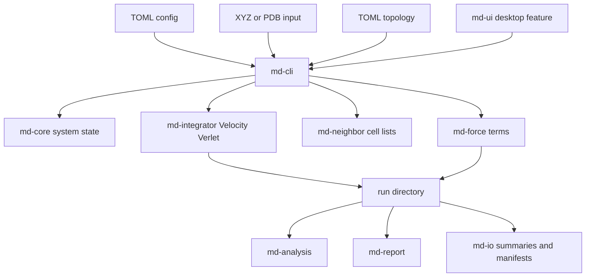

# Architecture

MD Workstation is a Rust workspace organized around a CLI-first molecular
dynamics engine. The optional desktop UI wraps existing workflows instead of
calling external MD engines.

## Workspace Crates

```text
crates/
  md-core/        System state, boxes, validation, and shared energy samples
  md-force/       LJ, Coulomb, bonded terms, exclusions, and force reports
  md-integrator/  Velocity Verlet integration
  md-neighbor/    Cell-list neighbor search and rebuild checks
  md-analysis/    Energy drift, RMSD, pair distances, and periodic unwrap
  md-report/      Markdown run report rendering
  md-io/          XYZ, PDB subset, CSV, JSON, and checkpoint I/O
  md-cli/         CLI workflow orchestration
  md-ui/          Optional desktop UI prototype
```

## High-Level Data Flow



## CLI Workflows

`md-cli` owns user-facing orchestration:

- `run <config>`: dynamics with trajectory, energy CSV, checkpoint, summary,
  manifest, and report output
- `minimize <config>`: conservative steepest-descent minimization
- `validate <config>`: config/input/topology validation
- `validate-suite [--long]`: curated validation examples
- `bench-neighbor <config>`: force-path comparison
- `analyze <run_dir>`: energy, RMSD, pair-distance, and periodic unwrap analysis
- `report <run_dir>`: refresh Markdown run report
- `inspect <run_dir>`: print reproducibility metadata
- `reproduce <run_dir>`: validate copied run inputs against manifest hashes
- `resume <run_dir>`: continue from recorded checkpoint metadata

## Simulation Model

The current engine uses reduced Lennard-Jones units and orthorhombic boxes.
Dynamics use Velocity Verlet with optional periodic wrapping. Force evaluation
can use either direct pair loops or cell-list neighbor search, and selected
force paths can run with Rayon CPU parallelism.

Supported force terms include:

- Lennard-Jones with cutoff and optional shifted potential
- per-element LJ defaults with Lorentz-Berthelot mixing
- cutoff Coulomb with optional shifted potential
- harmonic bonds
- harmonic angles
- periodic dihedrals
- bonded and explicit non-bonded exclusions

## Input And Topology

Configs are TOML files. Systems can be generated from lattice parameters or read
from coordinate input files.

Coordinate input supports:

- XYZ with multiple-frame reading where relevant
- a deliberately small PDB coordinate subset: `ATOM`, `HETATM`, `MODEL`,
  `ENDMDL`, and `END`

Topology input is project-local TOML. It can define charges, bonds, angles,
periodic dihedrals, and explicit exclusions. It is not a broad molecular
force-field import layer.

## Run Directory Contract

A dynamics run writes a product directory such as:

```text
runs/lj-fluid-001/
  config.toml
  trajectory.xyz
  energy.csv
  summary.json
  run-manifest.json
  run-report.md
  checkpoint.json  # or checkpoint.bin for binary checkpoints
```

Runs with coordinate or topology inputs copy those files into the run directory.
The manifest records stable output file names, checkpoint file and format,
hashes for copied inputs, engine metadata, platform metadata, Rayon thread
count, and command line.

## Desktop UI Boundary

`md-ui` is optional and feature-gated behind `desktop`. Its job is to make the
existing CLI workflow easier to inspect:

- list validation configs
- edit TOML
- invoke runs
- list run directories
- preview trajectories and energy CSV files
- display Markdown reports

The CLI remains the reliable primary interface.
